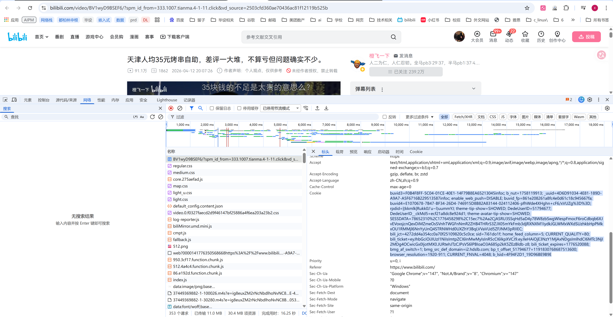

# 短视频评论 AI 分析平台产品说明书

## 一、产品定位

本平台是一个面向 Bilibili 短视频评论场景的 AI 辅助分析 Demo，适合用于热点事件观察、产品舆情初筛、评论观点梳理、用户反馈分析与课程/论文展示。

平台围绕“视频 → 评论 → 情感 → 主题 → 总结 → 报告”的分析链路设计，帮助用户从大量短文本评论中快速识别整体情绪、群体差异、地区差异、核心议题和潜在讨论焦点。

## 二、重点 AI 功能

本 Demo 的 AI 能力不是单点调用大模型，而是围绕短视频评论分析任务，将数据获取、语境理解、模型判断、可视化解释和报告生成串成完整产品流程。重点 AI 功能包括：

### 1. LLM 事件级情感分析

平台使用 DeepSeek 对评论进行积极、中性、消极三分类。与普通情感分析不同，事件级情感分析不是简单判断评论语气好坏，而是围绕视频讨论的具体事件、争议对象或公共议题判断评论立场，适合分析热点事件、产品发布、商业争议和社会话题。

该功能体现的产品价值是：将“情绪识别”升级为“观点立场识别”，让分析结果更贴近舆情研判和用户反馈分析场景。

### 2. AI 生成事件 Prompt

当用户选择事件级情感分析时，平台支持由 AI 自动生成更贴合当前视频语境的 Prompt。系统会综合视频标题、UP 主、发布时间、视频基础信息、评论样本，以及可选的视频总结内容，让 DeepSeek 识别视频正在讨论的核心事件，并生成适合该事件的分类提示词。

该功能解决的问题是：普通用户很难手写高质量事件级 Prompt。通过 AI 生成 Prompt，可以降低配置门槛，同时提高情感分类口径的一致性。

### 3. 视频字幕总结与 ASR 转写

视频总结模块优先读取 B 站字幕，生成视频核心内容、关键时间线、主要观点和评论分析参考。考虑到 B 站字幕接口可能不稳定，平台进一步提供 ASR 音频转写能力，通过 OpenAI ASR 从视频音频中识别文字，再用于总结和后续情感分析语境补充。

该功能的价值是：把视频内容从非结构化音视频转为可被模型理解的文本上下文，帮助评论分析不再只看评论本身，而是结合视频实际内容进行判断。

### 4. AI 情感差异分析报告

情感分析完成后，平台可以基于整体情感分布、性别差异、地区差异和高频词统计，自动生成中文分析报告。报告不会每次刷新自动调用，而是由用户点击按钮触发，避免重复扣费。

该功能面向产品经理和分析人员的实际工作流：把图表结果进一步转化为可阅读、可汇报的分析结论。

### 5. AI 主题分析报告与主题命名

主题分析模块在 BTM 主题建模基础上，支持 AI 对主题关键词进行自动命名，并生成主题分析报告。AI 会结合主题关键词、主题占比、评论样本和情感交叉结果，总结主要讨论方向、潜在分歧和解释注意事项。

该功能解决的是主题模型“有关键词但难解释”的问题，让算法输出更接近业务语言。

### 6. 图表级 AI 辅助解释

平台在整体分布、性别差异、地区分布、主题分布等图表中加入了高频词 Top10、地图热度、群体差异和 AI 报告能力。用户不仅能看到“数值是多少”，还能进一步理解“为什么可能出现这种差异”。

该功能体现的是 AI 产品设计中的解释层：用词频、分组统计和大模型总结共同提升分析结果的可解释性。

## 三、适用场景

- 热点事件评论分析：观察网友围绕具体事件、争议对象或公共议题的态度分布。
- 产品发布反馈分析：分析用户对产品、功能、价格、体验或品牌动作的正负向反馈。
- 内容传播效果分析：了解一个视频引发的主要讨论方向、情绪倾向和高频关注点。
- 研究与展示 Demo：作为短视频评论文本挖掘、LLM 情感分类、BTM 主题建模和可视化分析的交互式样例。

## 四、使用前配置

首次使用前，请在左侧边栏的 **⚙️ 系统配置** 中完成必要配置：

- **Bilibili Cookie**：用于提升评论爬取稳定性。Cookie 失效、缺失或权限不足时，可能出现爬取失败、数据不完整或请求受限。
- **DeepSeek API Key**：用于情感分析、AI 生成 Prompt、情感差异报告和主题分析报告。
- **OpenAI ASR API Key**：仅在使用视频总结中的 ASR 音频转写功能时需要配置。
- **停用词配置**：用于词频统计、主题分析和图表悬浮词频展示。停用词是指分析中需要过滤的常见无意义词，例如“这个”“不是”“然后”等；根据具体视频语境自定义停用词，通常能提升主题和词频结果质量。

## 五、推荐使用流程

1. 进入 **数据爬取** 页面，输入 B 站视频链接或 BV 号，设置最大爬取页数。
2. 点击爬取按钮，获取视频一级评论数据。当前评论默认按热度优先获取，通常会优先覆盖点赞较高的热评。
3. 进入 **数据展示** 页面，检查评论数量、视频信息、性别分布、IP 属地、点赞量和评论内容是否正常。
4. 进入 **视频总结** 页面，可选地获取字幕或使用 ASR 转写，生成视频核心内容总结。若后续要做事件级情感分析，建议先完成视频总结。
5. 进入 **情感分析** 页面，选择 Prompt 模板，设置分析条数与并发数，运行 DeepSeek 情感分类。
6. 在情感分析结果中查看整体分布、性别差异、地区分布和 AI 分析报告。
7. 进入 **主题分析** 页面，基于评论文本进行 BTM 主题建模，查看词云、主题关键词、主题分布和 AI 主题分析报告。
8. 根据需要下载评论数据、情感分析结果或后续分析文件，用于论文、汇报或进一步处理。

## 六、核心功能说明

### 1. 数据爬取

数据爬取模块用于从 Bilibili 视频评论区获取一级评论，并保存为 CSV 文件。主要字段包括评论内容、评论时间、点赞数、用户昵称、用户性别、IP 属地、视频标题、BV 号、UP 主信息和视频统计信息。

当前仅统计一级评论，不包含楼中楼回复。由于 B 站接口策略和 Cookie 状态可能变化，实际可爬取数量会受到视频热度、评论总量、登录状态、访问频率和平台限制影响。

### 2. 数据展示

数据展示模块用于快速检查原始评论数据质量。页面提供视频信息概览、评论列表、关键词筛选、性别筛选、排序和基础统计。视频标题等较长信息支持鼠标悬停查看完整内容。

这一页建议作为分析前的数据校验环节。如果发现评论为空、IP 属地异常、视频信息不匹配或样本量过小，应先回到数据爬取页面重新获取数据。

### 3. 视频总结

视频总结模块用于获取视频字幕并生成内容摘要、关键时间线、主要观点或事件脉络。

平台优先尝试读取 B 站字幕接口。由于 B 站字幕接口存在不稳定情况，字幕可能偶发不属于当前视频。页面会提示用户人工核对字幕内容。如果字幕明显错误，可以多次重新获取，或使用 ASR 音频转写方式。

ASR 是 Automatic Speech Recognition，即自动语音识别。它会从视频音频中转写出文字，再用于总结。ASR 通常准确率更稳定，但需要配置 OpenAI ASR API Key，并且会产生额外调用成本。

### 4. 情感分析

情感分析模块使用 DeepSeek 对评论进行情感分类，输出积极、中性、消极三类结果。

平台提供两类分析方式：

- **事件级情感分析**：围绕视频讨论的具体事件、争议对象或公共议题判断评论立场，适合热点事件、产品发布、社会争议等语境。
- **通用情感分析**：只根据评论文本本身判断积极、中性或消极，适合日常话题、泛娱乐内容或没有明确事件对象的评论。

事件级情感分析支持 AI 生成 Prompt。系统会结合视频标题、UP 主、发布时间、视频基础信息、评论样本和可选的视频总结，生成更贴合当前视频语境的分析提示词。若先在视频总结页面生成总结，Prompt 通常会更精准。

情感分析支持并发调用以提升速度。并发数越高，速度越快，但也更容易受到 API 速率限制影响。为保证稳定性，建议先使用默认并发数。

### 5. 情感分析可视化

情感分析结果包含四个栏目：

- **整体分布**：展示所有评论的积极、中性、消极数量和占比。
- **性别差异**：按用户性别比较不同群体的情感分布。
- **地区分布**：按中国省级地区展示评论数量、情感构成和积极倾向热图。
- **AI 分析**：基于整体、性别和地区统计自动生成文字分析报告。

中国地图热图的热度定义为：

```text
积极评论数 / (积极评论数 + 消极评论数)
```

中性评论不参与热度分母。境外 IP、未知 IP 会被排除；港澳台保留。鼠标停留在地图、柱状图或饼图上时，会展示对应群体的评论高频词 Top10。

### 6. 主题分析

主题分析模块使用 BTM（Biterm Topic Model）对短文本评论进行主题建模。BTM 更适合短评论场景，因为它直接建模词对共现关系，能缓解单条评论过短导致的主题稀疏问题。

主题分析结果包含：

- **词云**：展示整体评论中的高频关键词。
- **主题关键词**：展示每个主题的 Top 关键词，并支持 AI 为主题自动命名。
- **主题分布**：展示不同主题的评论占比和数量；若已经完成情感分析，还会展示主题与情感的交叉结果。
- **AI 分析**：自动总结主要讨论主题、主题热度、潜在观点分歧和可解释性注意事项。

## 七、数据口径说明

- 评论范围：当前仅爬取视频一级评论，不包含楼中楼回复。
- 评论排序：当前爬取默认按热度优先，通常会优先覆盖点赞较高的热评。
- IP 属地：来自 B 站评论接口返回的公开 IP 属地字段，不能等同于用户真实常住地。
- 性别字段：来自用户公开资料，可能存在保密、缺失或不准确。
- 情感标签：由大模型根据 Prompt 判断，结果具有统计参考价值，但不应作为绝对人工标注。
- 地图热度：只统计积极和消极评论，中性评论不进入热度分母。
- 主题结果：主题命名和主题解释具有一定主观性，建议结合原始评论样本共同判断。

## 八、结果解读建议

使用本平台时，建议重点关注趋势而不是单条结论。样本量较小时，性别差异、地区差异和主题占比容易受到少数评论影响。对于样本量低于 3 的群体，分析结果只适合作为参考。

情感分析结果建议结合 Prompt、视频语境和评论样本共同验证。事件级情感分析尤其依赖事件定义，如果 Prompt 对事件对象描述不清，模型可能会把“对视频作者的态度”“对事件本身的态度”“对评论对象的态度”混在一起。

主题分析结果建议结合停用词配置反复调试。如果主题关键词中出现大量无意义词、平台词、口头词或视频专属噪声词，可以将这些词加入停用词后重新建模。

## 九、常见问题

**Cookie如何获取？**



可以通过电脑浏览器的开发者工具获取当前登录状态下的 Bilibili Cookie：

1. 使用电脑浏览器打开任意一个 B 站视频页面，并确保当前账号已登录。
2. 按 `F12` 打开开发者工具。
3. 切换到 **网络**（Network）面板。
4. 刷新当前视频页面，让浏览器重新加载网络请求。
5. 在左侧请求列表的 **名称** 一栏中，找到并点击任意一条以 `BV` 开头的视频相关请求。
6. 在右侧详情面板中打开 **标头**（Headers）。
7. 向下找到 **请求标头**（Request Headers）区域，其中的 `Cookie` 字段就是需要复制到本项目侧边栏配置中的内容。

注意：Cookie 等同于当前账号的登录凭证，如果 Cookie 失效，只需要按上述步骤重新获取并替换即可。

**为什么评论爬取数量和预计评论数不一致？**

B 站接口分页、登录状态、访问频率和评论区权限都会影响实际返回结果。页面中的预计评论数只是根据页数和分页大小估算。

**为什么字幕内容偶尔和视频对不上？**

B 站字幕接口存在不稳定情况，返回的临时字幕链接可能异常。建议人工核对字幕预览；如果字幕错误，可以重新获取或改用 ASR 音频转写。

**为什么地图热图颜色很浅？**

如果某批数据中积极评论很少，热度值会接近 0，地图颜色自然偏浅。可以查看悬浮窗中的积极、消极、中性数量确认。

**为什么 AI 分析报告需要手动点击生成？**

AI 报告会调用 DeepSeek API。为了避免页面刷新重复扣费，系统采用按钮触发和缓存展示的方式。

**为什么主题分析结果看起来不稳定？**

主题模型会受到样本量、停用词、分词质量、主题数和评论文本长度影响。短文本主题建模更适合观察高频讨论方向，而不适合解释每一条评论的精确语义。

## 十、使用边界与风险提示

本平台是 Demo 性质的辅助分析工具，适合用于探索、展示和初步研判。分析结果不应直接作为商业决策、公共舆情定性、用户画像判断或高风险决策依据。

平台依赖第三方接口和外部模型服务。Bilibili 接口、字幕接口、DeepSeek API、OpenAI ASR API 的可用性、费用和返回结果都可能发生变化。请勿在公开环境泄露 Cookie 或 API Key。
